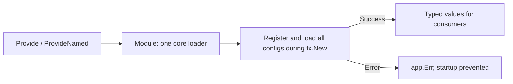

# confx

[](https://pkg.go.dev/github.com/uchaloop/confx) [](https://github.com/uchaloop/confx/actions/workflows/ci.yml) [](https://github.com/uchaloop/confx/tags) [](LICENSE)

**Explicit confmaker registration for Uber Fx.** confx provides typed configs to
Fx consumers. [confmaker](https://github.com/uchaloop/confmaker) owns defaults,
ENV parsing, validation and diagnostics; the adapter owns wiring them into Fx.

[Install](#installation) · [Quick start](#quick-start) · [Instances](#multiple-instances) · [Lifecycle](#lifecycle-and-errors) · [Diagnostics](#load-diagnostics) · [Testing](#testing) · [Reference](#reference)

## Installation

Requires **Go 1.27 or later**. The command below installs the tagged release.

```sh
go get github.com/uchaloop/confx@v0.2.0
```

```go
import "github.com/uchaloop/confx"
```

Import `github.com/uchaloop/confmaker` when using core options such as `WithEnv`,
`WithPrefix` or `WithDump`.

## Quick start

```go
package main

import (
	"fmt"
	"log"

	"github.com/uchaloop/confx"
	"go.uber.org/fx"
)

type ServerConfig struct {
	Port int `env:"PORT"`
}

func (c *ServerConfig) SetDefaults() { c.Port = 8080 }

func main() {
	app := fx.New(
		confx.Module(),
		confx.Provide[ServerConfig]("server"),
		fx.Invoke(func(cfg ServerConfig) {
			fmt.Println(cfg.Port) // Pass the config to your server constructor.
		}),
	)
	if err := app.Err(); err != nil {
		log.Fatal(err)
	}
	app.Run()
}
```

Run with no ENV for the default `8080`, or set `SERVER_PORT` in your IDE or shell.
The config type needs no dependency on either confmaker or Fx.



## Multiple instances

An instance name, an ENV prefix and an Fx tag serve different purposes:

| Concept | Source | Purpose |
|---|---|---|
| Instance name | First argument to Provide / ProvideNamed | Core registration identity and diagnostics |
| ENV prefix | Derived from the name, or WithPrefix | Variable lookup |
| Fx name tag | ProvideNamed only | Select a named dependency |

Using `ServerConfig` from the quick start, replace its registration with:

```go
confx.Provide[ServerConfig]("server"),
confx.ProvideNamed[ServerConfig]("replica", confmaker.WithPrefix("READ_SERVER_")),
```

The first reads `SERVER_PORT`, the second `READ_SERVER_PORT`. Consume them with:

```go
type Params struct {
	fx.In
	Primary ServerConfig
	Replica ServerConfig `name:"replica"`
}
```

Use `fx.Invoke(func(p Params) { /* use p.Primary and p.Replica */ })` or take
`Params` in a constructor. Two untagged providers of the same type conflict in
Fx even if their instance names differ. `WithPrefix` never changes the Fx tag.

## Lifecycle and errors

Include exactly one `confx.Module()` or `confx.FromLoader(loader)`.
All provided configs load during `fx.New`, including those with no consumers.
A core loading error is available through `app.Err()` and prevents startup.

Core structured errors remain reachable through Fx's wrappers:

```go
if err := app.Err(); err != nil {
	for _, problem := range confmaker.ConfigErrors(err) {
		fmt.Println(problem.Kind, problem.InstanceName, problem.VariableName)
	}
	log.Fatal(err)
}
```

Always handle the original error: missing Module and Fx dependency conflicts are
not core `ConfigError` diagnostics. Config values should be treated as read-only.
Provider options may be reused across applications; each app receives its own
loader and values.

## Load diagnostics

Use the core handler option to process a value-free report before Fx receives a
configuration loading error, while keeping `fx.New(...).Run()`:

```go
fx.New(
    confx.Module(
        confmaker.WithDiagnosticHandler(func(report confmaker.LoadReport) {
            // Format the report with your application's logger.
        }),
    ),
    confx.Provide[ServerConfig]("server"),
).Run()
```

The handler runs once during configuration loading in `fx.New`, on success or
error. It receives sources, statuses and structured categories, without values or
error messages. Loading panics propagate and skip the handler. No automatic
logging or additional Fx adapter is involved.

For explicit inspection after `app := fx.New(...)`, create
`diagnostics := confmaker.MakeDiagnostics()`, pass
`confmaker.WithDiagnostics(diagnostics)` to `Module`, and read
`diagnostics.Report()` before calling `Run`. Reading it after `Run` is unsuitable
for startup errors because Fx may terminate the process.

In external-loader mode, pass these options to `confmaker.MakeLoader` and use
`FromLoader` as usual. If Fx rejects the graph or registration mode before loading
begins, there is no load report: the receiver remains `LoadNotStarted` and the
handler is not called. Inspect `app.Err()` for those Fx errors. Each Diagnostics
receiver belongs to one loader; use a fresh receiver for each ordinary Module app.

## Testing

Pass an isolated ENV map to Module. This setup uses `ServerConfig` above and
imports `testing`, confmaker, confx and Fx:

```go
func TestServerConfig(t *testing.T) {
	t.Parallel()

	var got ServerConfig
	app := fx.New(
		fx.NopLogger,
		confx.Module(confmaker.WithEnv(map[string]string{"SERVER_PORT": "9090"})),
		confx.Provide[ServerConfig]("server"),
		fx.Populate(&got),
	)
	if err := app.Err(); err != nil {
		t.Fatal(err)
	}
	if got.Port != 9090 {
		t.Fatalf("unexpected port: %d", got.Port)
	}
}
```

No `app.Start` is needed to inspect configuration values: loading already
happened during construction. In a real app, unrelated constructors can run
during `fx.New`; this is not a general-purpose dry-run mode.

## External loader and manifest

The simple Module + Provide API remains the default. For documentation generation
without reading ENV or constructing services, register configurations in the core
before creating Fx, then bridge their handles into the application:

```go
package main

import (
    "flag"
    "log"
    "os"

    "github.com/uchaloop/confmaker"
    "github.com/uchaloop/confx"
    "go.uber.org/fx"
)

type ServerConfig struct {
    Port int `env:"PORT,required"`
}

func main() {
    describe := flag.Bool("describe", false, "Print configuration documentation")
    flag.Parse()

    loader := confmaker.MakeLoader()
    server := loader.Register[ServerConfig]("server")

    if *describe {
        if err := loader.WriteManifestMarkdown(os.Stdout); err != nil {
            log.Fatal(err)
        }
        return
    }

    fx.New(
        confx.FromLoader(loader),
        confx.FromHandle(server),
        fx.Invoke(func(cfg ServerConfig) { log.Printf("server port: %d", cfg.Port) }),
        // Add runtime modules here.
    ).Run()
}
```

`go run . -describe` completes before `fx.New`; required ENV is not needed.
Normal startup loads during `fx.New`. Either Run or explicit Start/Stop is valid:
separating description from application construction is what matters.

| Adapter | Purpose |
|---|---|
| `FromLoader(loader)` | Use an existing loader instead of Module |
| `FromHandle(handle)` | Provide an existing registration as an untagged value |
| `FromHandleNamed(handle)` | Provide it with its registration name as the Fx tag |

All registrations load, even when no handle has a consumer. Handles must belong
to the supplied loader; nil, zero and foreign handles fail construction.
An already-loaded loader reuses its result. Reusing an external loader across
apps also shares its values and load state; create separate loaders for isolation.

The two modes cannot be mixed: Module accepts only Provide/ProvideNamed;
FromLoader accepts only FromHandle/FromHandleNamed. Mode and handle ownership
checks finish before any registration or loading. Invalid connections leave the
external loader unchanged, so a corrected connection can reuse it. Once Load
has run, its result remains final as usual.

Register every config outside Fx in the extended mode. The manifest generated
before fx.New then describes the complete registration set.

For export formats and guarantees, see the core
[manifest guide](https://github.com/uchaloop/confmaker#manifest-and-configuration-documentation).
The adapters do not parse flags or terminate the process.

## Reference

- [confx GoDoc](https://pkg.go.dev/github.com/uchaloop/confx): adapter API.
- [confmaker README](https://github.com/uchaloop/confmaker#readme): tags, secrets, errors and loading rules.
- [Changelog](CHANGELOG.md): release and migration notes.

## Acknowledgements

Thanks to the authors and maintainers of [Uber Fx](https://github.com/uber-go/fx)
for its dependency injection and lifecycle primitives.

## License

[MIT](LICENSE)
