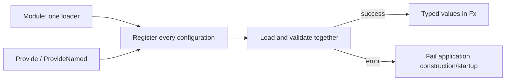

# confx

[](https://pkg.go.dev/github.com/uchaloop/confx) [](https://github.com/uchaloop/confx/actions/workflows/ci.yml) [](https://github.com/uchaloop/confx/tags) [](LICENSE)

[Install](#installation) · [Quick start](#quick-start) · [How it works](#how-it-works) · [Configuration](#name-prefix-and-tag) · [Examples](#documentation)

The [Uber Fx](https://github.com/uber-go/fx) adapter for
[confmaker](https://github.com/uchaloop/confmaker): it loads configs when the
application starts and provides them to the Fx container.

## Installation

Requires Go 1.27 or later.

```bash
go get github.com/uchaloop/confx@v0.1.0
```

Declaring configs, tags, JSON values, the manifest and the dump are described in
the [confmaker README](https://github.com/uchaloop/confmaker#readme) and its
[package documentation](https://pkg.go.dev/github.com/uchaloop/confmaker).

## Quick start

```go
package main

import (
    "fmt"

    "github.com/uchaloop/confx"
    "go.uber.org/fx"
)

type Config struct {
    Port int `env:"PORT"`
}

func (Config) ConfigName() string { return "server" }
func (c *Config) SetDefaults() { c.Port = 8080 }

func main() {
    fx.New(
        confx.Module(),
        confx.Provide[Config](), // SERVER_PORT, default 8080
        fx.Invoke(func(cfg Config) { fmt.Println(cfg.Port) }),
    ).Run()
}
```

`Module` is required once. Configurations are loaded during dependency resolution,
including registrations with no consumer. Loading errors prevent successful startup.
The configuration type has no dependency on Fx or confmaker.

| Registration | What the consumer receives |
|---|---|
| `Provide[Config]()` | Untagged Config |
| `ProvideNamed[Config]("replica")` | Config with Fx tag `name:"replica"` |

<details>
<summary><strong>Two configurations of the same type</strong></summary>

```go
confx.Provide[Config](),
confx.ProvideNamed[Config]("replica"), // REPLICA_PORT
```

```go
type Params struct {
    fx.In
    Primary Config
    Replica Config `name:"replica"`
}
```

</details>

## How it works



> [!NOTE]
> `WithName` changes the configuration instance name. Only `ProvideNamed`
> adds an Fx name tag. These are separate mechanisms.

## Name, prefix and tag

These are three different things:

| | Comes from | Used for |
|---|---|---|
| instance name | `ConfigName`, `confmaker.WithName`, or the `ProvideNamed` name | the default prefix and errors |
| ENV prefix | the instance name (`replica` → `REPLICA_`), or `confmaker.WithPrefix` | variable names |
| Fx tag | `ProvideNamed` only | how consumers ask for the value |

`Provide` with `confmaker.WithName` changes the name and prefix but adds no Fx
tag. `ProvideNamed` refuses a further `WithName`.

`Module` takes the options of `confmaker.MakeLoader`, such as
`confmaker.WithDump(os.Stdout)` or `confmaker.WithEnv(vars)` in tests.

## Documentation

[pkg.go.dev/github.com/uchaloop/confx](https://pkg.go.dev/github.com/uchaloop/confx)

## Recommended configuration

> [!TIP]
> We recommend [confmaker](https://github.com/uchaloop/confmaker) for typed ENV
> configuration and [confx](https://github.com/uchaloop/confx) for its Fx integration.
> Configuration loading stays in the application; it is optional for the work libraries.

<details>
<summary><strong>Configure from ENV with confmaker / confx</strong></summary>

The pair separates configuration declarations from application wiring. A
library declares an ordinary struct; the application chooses how to load it:

```go
type Config struct {
    Port int `env:"PORT"`
}

func (Config) ConfigName() string { return "server" }
func (c *Config) SetDefaults() { c.Port = 8080 }
```

Without Fx:

```go
cfg, err := confmaker.Load[Config]() // SERVER_PORT, default 8080
```

With Fx:

```go
confx.Module(),
confx.Provide[Config](),
```

Import `github.com/uchaloop/confmaker` for the loader or
`github.com/uchaloop/confx` for the Fx adapter.

</details>

## Related libraries

| Library | Purpose |
|---|---|
| [confmaker](https://github.com/uchaloop/confmaker) | ENV tags, validation, manifest and dump |
| [jobfx](https://github.com/uchaloop/jobfx) | One-shot work through Fx |
| [beatfx](https://github.com/uchaloop/beatfx) | Recurring work through Fx |

## Acknowledgements

Thanks to the authors and maintainers of [Uber Fx](https://github.com/uber-go/fx)
for dependency injection and lifecycle primitives that make this adapter possible.

## License

[MIT](LICENSE)
